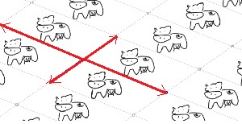
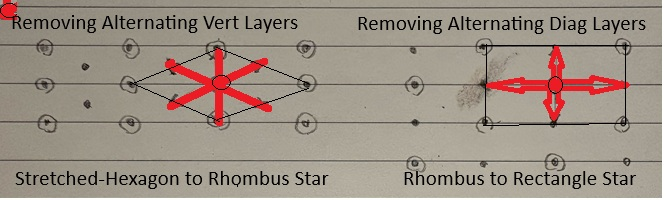
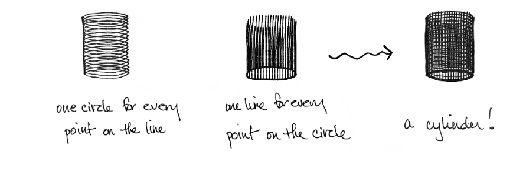
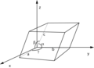
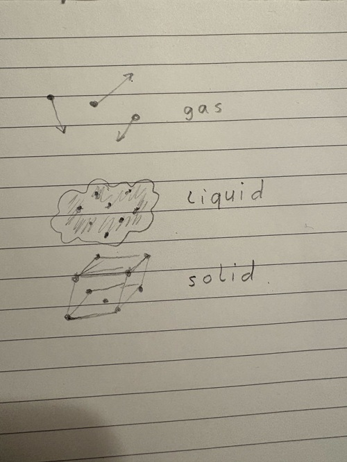
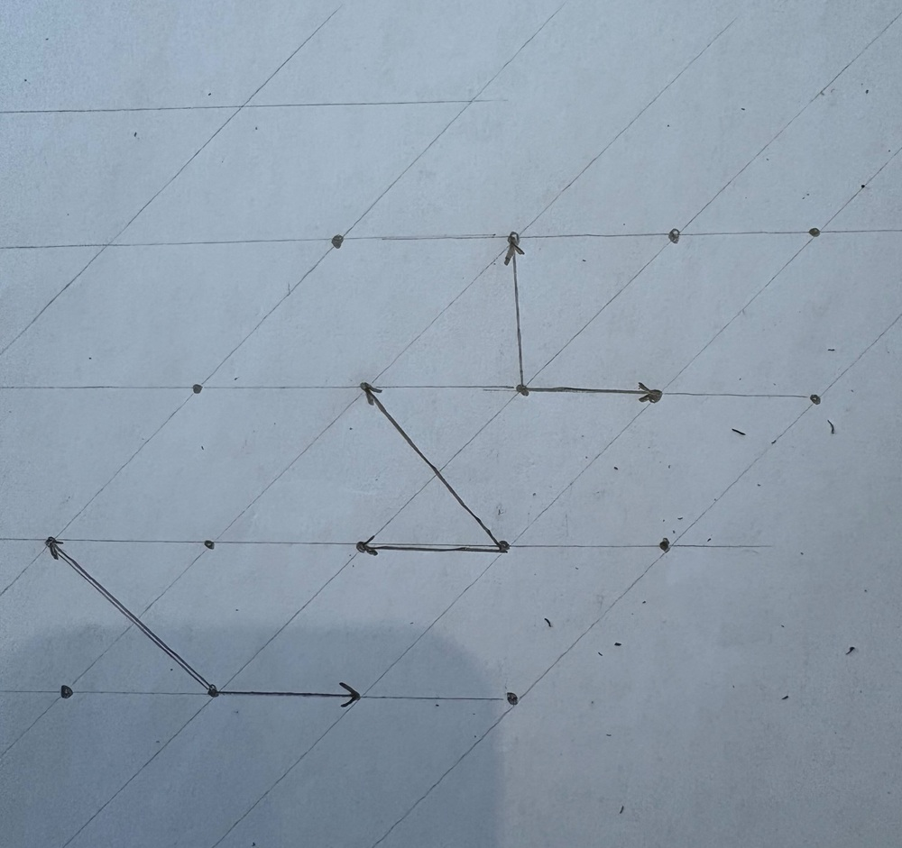
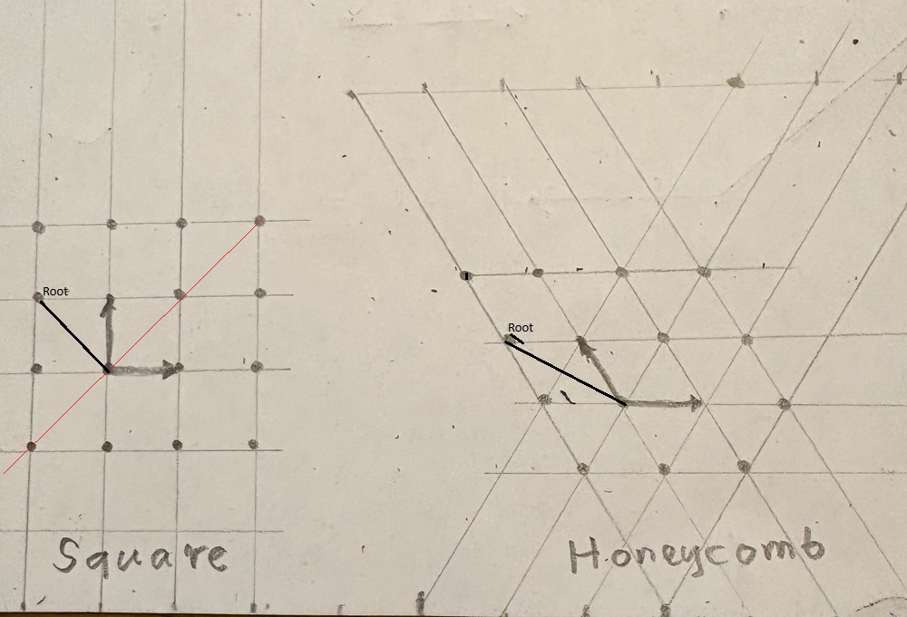

# Mathematical Crystallography

## Translational Symmetries of Crystals and Wallpapers
Crystallography is about classification of spatial distribution of atoms and molecules.
These shapes are microscopic and we cannot observe them directly but the terminology used to describe them is the same that is used when we talk about those that we can.
While molecular arrangements are 3-dimensional, a lot can be learnt about them by studying 2-dimensional case.
Wallpaper is a 2-D pattern that 'repeats itself' when shifted by some specific distance in specific directions (in at least 2 distinct directions).

The image above was generated from this website https://observablehq.com/@esperanc/wallpaper-groups.
See also https://geo.libretexts.org/Bookshelves/Geology/Mineralogy_(Perkins_et_al.)/11%3A_Crystallography/11.03%3A_Unit_Cells_and_Lattices_in_Two_Dimension/11.3.02%3A_What_are_the_Possible_Plane_Lattices

Similarly, a molecules arrangement is called a *Crystal* if it repeats itself when shifted by some specific distance in specific directions (in at least 3 directions not in the same plane).

Directional distances are also called *vectors* and can be visualized as 'floating' arrows (marked red above).
The set of vectors that 'repeats' a pattern (in 2D and 3D) is called the *group of (translational) symmetries* of the pattern.
It is sometimes useful not to be distracted by details of the repeating picture and replace that picture by a single dot.
Such simplified repeating pattern is called a *lattices*.
Allowing for some ambiguity, we will use the term *lattice* to refer both to such simplified point-pattern and to the group of its translational symmetries.

### Vectors
Vectors can be added and multiplied by numbers in usual way. Multiplication of vectors can also be defined but will not deal with it now. We do however have 'scalar' or 'dot'
multiplication defined as a&sdot;b=|a||b|cos(&alpha;) where &alpha; is the angle between a and b, |a| and |b| the length of a and b respectively.
If 2 vectors are symmetries of a pattern then their sum is also a symmetry. Multiplying a symmetry by a number will not, in general, be a symmetry but it will be one for whole numbers.

### Unit Cell
In any 2D-lattice one can find 2 vectors (a, b) such that any lattice vector can be represented uniquely as ma+nb for some whole numbers m, n.
Similarly, for any 3D-lattice one can find 3 vectors (a, b, c) such that any lattice vector can be represented uniquely as ma+nb+oc for some whole numbers m, n, o.
This pair (triple) is called a *unit cell* of the lattice. The 'shape' of a unit cell is fully described by the scalar products between its elements.
For 2-D unit cell (a, b) it will be |a|, |b|, a&sdot;b = |a||b|cos(&alpha;).
Similarly, for a 3D unit cell (a, b, c) it will be |a|, |b|, |c|, a&sdot;b = |a||b|cos(&gamma;), b&sdot;c = |b||c|cos(&alpha;), c&sdot;a = |c||a|cos(&beta;).
These numbers are called *cell parameters*. For wallpaper pattern the parameters can be measured directly.
For crystals, the assumption is that angles between flat faces correspond to cell angles and the 3 sizes could be calculated using X-ray diffraction.

## Parameters

### Coordination Star
A lattice can have infinitely many unit cells with different shapes.
If we want to talk about the 'shape' of the lattice we need a way to narrow down that number to some 'special' ones and use their 'shapes' as representative for the lattice itself. 
This can be done as follows: We define the *radius* of (a, b, c) to be largest of the numbers |a|, |b|, |c|. The 'special' cells will be those with smallest radius.
The shape consisting of all cell-vectors a, b, c for all these 'special' cells is called a *coordination star*.
There is always more than one cell in the coordination star (but at least that number is finite).
For example, changing the direction of a creates a new unit cell where angles &beta; and &gamma; are replaced by their 180&deg; complements.

With this we are now able to compare Lattices in a meaningful way:

> 2 Lattices are considered coordination-equivalent if their coordination stars have the same number of elements, same number of longest elements and same number of shortest elements.

### Mirror Symmetries
There are other ways a pattern can be symmetric other than by-translations.

The above show an example with 2 mirror symmetries (shown in blue).
(An object is mirror-symmetric if it is possible to make a plane-cut of it in such a way that when one of the halves is placed flat-side on a mirror then
the half together with its reflection will form a shape which is indistinguishable from the original one).
In order to treat separately Lattices which have such additional symmetries we need to refine our definition of equivalence:

> 2 Lattices are considered mirror-equivalent if their coordination stars have the same number of mirror symmetries.

#### Irreducible Coordination

A coordination is *reducible* if it can be broken up into subsets mutually orthogonal to each other and *irreducible* otherwise.
Irreducible components of a reducible coordination are coordination stars of lower dimensions (1 and 2 - in case of 2 components. 1 in case of 3 components).
A pattern with reducible 1-2 coordination is then made up of 2D (wallpaper) patterns stacked neatly on top of each other.

### Centered Cells and P-patterns
Choosing 3 vectors a', b', c' in some Lattice L (a, b, c), not restricted to a plane will not, in general, be a unit cell since their integral combinations L'
may not include all of a, b, c. L' however is a lattice in its own rights, namely one obtained by removing from L all combinations ma+nb+oc which fall within the boundary of the a', b', c' - cell. We say that L is *center-derived* from L'.
The following shows 2 plane lattices which are center-derived from each other.

* Identical 1D patterns placed directly next to each other forming a rectangular coordination star.

* Same 1D patterns where adjacent layers are shifted by half the cell size of the 1D pattern.

# Naming of Lattice Families
Center-derivations is used in naming of lattice families.

We start by giving the name

* Triclinic

to the most 'asymmetric' lattice of all - one where |a|, |b|, |c| are all distinct and there are no 90&deg; angles present (no mirror symmetries).
We then name all reducible lattices (also called *primitive*). Their names attempt to convey the shape of the 2D wallpaper lattice.

* Monoclinic - based on parallelogram

* Hexagonal - based on hexagon

* Orthorhombic - based on rectangle

* Tetraclinic - based on square

* Cubic - also based on square but with distance between layers equal to that of side of the square which leads to additional mirror symmetries.

It turns out that any other lattice can be center-derived from one of the primitive lattices above.
The names of remaining lattices are then (with one exception) derived from the name of the corresponding primitive lattice by adding a 1-letter suffix
to distinguish between different ways the corners of the inner cell are placed within the outer cell.
We also use P-suffix to indicate the primitive lattice.

The exception mentioned is for the lattice (a,b,c) where |a|=|b|=|c| and a&sdot;b = b&sdot;c = c&sdot;a != 0 which is called

* Trigonal

It can be centered within the Hexagonal P-lattice but there was no 1-letter designated to describe that placement.

## Symmetries of Shape
### Definition
Shapes placed in Space can be relocated. These relocations are called *motions*. Two main types of motions are *translations* and *rotations*.
The defining property of a motion is that it preserves the distance between any pair of items selected on the shape. Additional types of motions will be introduced
in the *Improper Motions* section below.
A motion will, in general, change the location occupied by the shape in Space
but in some special cases that location will remain the same.
We say then that the shape exhibits *symmetry* relative to the motion performed.

#### Marked Shapes
A shape can have markers placed on it (f. ex. be painted over).
When the markers are taken into consideration, only the motions which do not change the outside appearance are considered symmetries.

### Examples
#### Rotational Symmetry of Plain Vase
A round vase exhibits rotational symmetry as demonstrated when placed on a pottery wheel.

#### Translational Symmetry of Straight Line
A straight infinite line exhibits translational symmetry (only an 'infinite' shape can have translational symmetry).

#### Symmetries of Painted Vase
If the vase is marked with a repeating pattern then only rotations by certain angles are symmetries.

### Improper Motions

#### Identity
It is customary to treat *sitting still* as a motion too. It is called the *Identity*.

#### Mirror Reflection
When a shape is placed in front of a mirror then another shape ('reflection') becomes visible on the other side.
If the reflection is indistinguishable to the original we say that the shape has mirror symmetry.
Human face is approximately mirror-symmetric (this is what makes mirrors useful in the first place).

#### Inversion
In old-style cameras, the light which carries the image of an object passes through an opening and hits the film roll at the back of the camera. The shape recorded on the film 
will generally be scaled in size. If the object is placed at appropriate distance to the lens, to preserve its size then the resulting shape
will be called the *Inversion* of the original. The inversion operation is unique to 3 dimensional Space. Similarly defined operation on the Plane is synonymous with 180&deg; rotation.

### Orthogonal Decomposition
Consider a plane and a line perpendicular to it. A shape can be ortho-projected on the line and on the plane producing 'shadow' images.
Conversely, from a pair of shapes, one on the plane-shape and another on the line, we can produce a space-shape by considering all points which ortho-project within the 2 shapes.
The shape thus produced is called the *Cartesian Product* (of the line and the plane shape). Similarly we can define Cartesian product relative to 3 intersecting lines perpendicular to each other.
We can also define Cartesian product of 2 motions: one on the line and another on the plane: It is the Space motion obtained by applying motions separately to the shadows and making Cartesian product of the moved shapes. If both of 'shadow' motions are symmetries then their Cartesion product is a symmetery of the product-shape itself. But the converse may not be true. 
For example symmetries of a Cube include some which cannot be viewed as a product of a symmetries of a square and edge shadows (namely diagonal symmetries).

#### Cylinder Example
Cylinder is a Cartesian product of a disk and a segment.

## Groups
2 symmetries can be combined to produce a 3rd called their *superposition*. The symmetry which performs the motion in-reverse of a given one is called its *inverse*.
A structure where 2 items produce the 3rd (their composition) is known in Mathematics as a *Group*.
Numbers can be considered a group in 2 ways: under *addition* and under *multiplication* (with 0 excluded). The group of symmetries of an infinite line has the same structure as the additive group of numbers.
The inversion together with the identity has the same group structure as the multiplicative number group consisting of 1 and -1.
A concrete motion usually references some geometric shape (f. ex. a reflection references a mirror plane).
But some properties of motions may be formulated solely in terms of the superposition alone. Here are some examples

### Order of Group Element
The smallest number *n* such that n-fold superposition with itself is the identity is called its *order*.
Inversions and mirror reflections are of order 2. Translations do not have an order. We say that they are of *infinite* order.
Rotation by angle 360&deg;/n has order n.

### Commutativity
The result of superposition of 2 motions is, in general, defined only if we know which one was executed first. For example superposition of 2 mirror reflections is a rotation around the line of intersection of the mirror-planes (by the amount equal to twice the angle between these planes). But whether this rotation is clockwise or counterclockwise depends on which reflection was performed first.
In case where the result is the same regardless of which motion was first we say that the motions *commute* with each other.
For example 2 reflections commute only if their planes intersect at right angle.
Inversion commutes with every motion that preserves its center point (f. ex. with a reflection which mirror plane contains the point of inversion).
A group where all pairs commute is called *commutative*. Both additive and multiplicative number groups are commutative.

### Direct Product
2 Groups can be combined to produce a 3rd, called their *direct product*.
The elements of that group are pairs of items: one item from one group and one from another. The composition is defined by composing both items separately.
Each of the 2 groups can be considered a subgroup of the product by restricting one of the item in the pair to the identity. 
Elements from one of these subgroups commute with those from the other.
In particular, direct product of commutative groups is commutative. 
The Cartesian Product of shadow-symmetries is the direct product of the 2 shadow-symmetry groups.
The group of Space translations has the same structure as the direct product of 3 additive number groups (and is therefore commutative).

## Discrete Groups of Translations and Unit Cell
A group of translations is called *discrete* if the length of its vectors is not arbitrarily small. A discrete group of translations has the structure
of a direct product of 3 copies of the additive group Z of whole numbers (integers). We can therefor find 3 vectors a, b, c such that
the group consists of combinations ma + nb + oc with integer coefficients m, n, p. This triple is called a *unit cell* of the discrete group. 
The length of any vector and the angle between any pair of vectors can be calculated from the 3 length a, b, c of and the 3 angles (&alpha;, &beta;, &gamma;) between
these 3 vectors of the unit cell.
Unit call can be selected in more than one way and is not an intrinsic property of the discrete group. However in most cases it is possible to select a unit cell in a 'natural' way.

Most materials in Nature exhibit translational symmetries. The numbers a, b, c are 'visible' indirectly by performing X-ray diffraction.

### Volume of Unit Cell
V = abc &radic;(1 + 2cos(&alpha;)cos(&beta;)cos(&gamma;) - cos2(&alpha;) - cos2(&beta;) - cos2(&gamma;))

### Coordination

*Coordination Star* of discrete group is a set of is vectors defined as follows:

* Choose smallest *r* such that a 'sphere' made of vectors of length r or shorter contains at least one unit cell.
* The *coordination star* is the set of all non-0, discrete translations enclosed by that sphere.

Coordination star is symmetric relative to inversion with respect to 0.
In the following, unless stated otherwise, we reserve term unit 'unit cell' to those found in the coordination star.
This makes the lengths a, b, c intrinsic properties of the group but changing direction of a-edge in unit cell creates a new unit cell where angles &beta; and &gamma;
are replaced by their 180&deg; complements.

Coordination is *reducible* if it can be broken up into subsets mutually orthogonal to each other and *irreducible* otherwise.
In reducible case the discrete group is a direct ortho-sum of subgroups.

### Classification of Unit Cells
2 unit cells are considered equivalent if their coordination stars are similar.
There are 17 different coordination stars.
Additional grouping is derived from inclusion. If we choose a subgroup of maximal rank in a discrete group then its unit cell will have the form a', b', c' where
a' = ma + nb + oc, e. t. c. That unit cell could, in general, have a different shape than the original one.
If the shape is indeed different then we call a, b, c *centered* in a', b', c'. A cell that is not a 'centered' in any other is called *primitive*.
There are 6 primitive coordination shapes and they were all given names. 4 of them are direct sums and the name conveys the corresponding planar shape.

* Orthoclinic - based on rectangle

* Monoclinic - based on parallelogram

* Tetraclinic - based on square

* Hexagonal - based on hexagon

The remaining 2 are

A centered cell is named after its parent-primitive. They are differentiated based on the location of the centers within the parent.
Different types of selecting these location were assigned a (more less) arbitrary names: C, J, e. t. c.
In one case, the centered cell derived from the hexagonal cell is given its own name

* Trigonal

### Symmetries of Discrete Groups
Technically, a set of vectors is not a 'real shape' but can be viewed as such if we take into account that 0 plays a special role.
Vector shapes can then be viewed as a collection of arrows originating at some arbitrary point (which we call *origin*).
A vector-motion will then be a motion in the ordinary sense of the word but only such which preserve the origin.
Every motion of an Euclidean shape can be related to a vector motion by looking at how it changes directions alone.
More precisely, any motion superposed with translation and then with its reverse will result in another translation.
The motion of vectors defined in this way is called the *inner* action.
The inner actions derived from symmetries of some shape form a group of vector motions which we call the *Point Group* of the shape.
There are over 200 groups of motions but only 32 point groups.
There are 7 Point groups which are considered 'special' and any of the remaining 25 groups is a subset of one of those 7.
These 'special' groups were originally derived form different conditions placed on cell parameters (such as a=b or &alpha=90&deg)
and were named accordingly. We can however arrive at these 7 using references to invariant properties only.

## Root System
The *Root System* is a vector shape obtained from coordination star in the following way:

* For each mirror symmetry of the star draw a line perpendicular to the mirror plane.
* find the pair of vector tips on that line which are closest to the origin.
* Root System is the collection of all such pairs.

If a root system can be divided into 2 sets such that roots from one set commute with those from the other then the root system is called *reducible* and *irreducible* otherwise.
The following are all possible irreducible root systems in dimensions 2 and 3.

A2 B2 G2 A3 B3 C3

In addition we have 3 groups of inversions I1-3 (one in each dimension. By forming direct products of lower-dimensional groups we arive at the following 9 'special' groups.

1. I3 Triclinic

1. I2 x I1 Monoclinic

1. I1 x I1 x I1 Orthorombic

1. A2 x I1 Hexagonal

1. B2 x I1 Tetragonal

1. G2 x I1 Trigonal

1. A3

1. B3 Cubic

1. C3

## Repeating Arrangements and Point Lattice

Consider a sample of substance made of identical particles of some kind.
There are 2 types of particle's properties to consider:

* internal (electron orbitals around the nucleus made of protons and neutrons, distribution of atoms within the molecule)

* external (arrangement of particles relative to one another).

Atoms in a molecule are held by strong covalent bonds which gives the molecule a specific shape (as depicted in balls-and-sticks diagrams).
There is additional tendency for separate molecules to coalesce. That molecular affinity is countered by environmental factors such as heat or presence of solvent but, in right circumstances, it will result is producing a physical solid sample. The shape of that sample can again be represented by balls-and-sticks except that in this case
a ball is an idealized representation of the entire molecule and the number of the balls is, in-principle, unlimited. In addition, that arrangement often forms as a repeating
pattern. The term *repeating pattern* will be made more precise further down but, informally, it means that all positions in the sample can be extrapolated from a relatively small fragment or *Cell*. If such repeating arrangement is present we call it a *Point Lattice* and the sample is said to be a *Crystal*.

### The Case of Unequal Particles
Similar discussion applies to a substance which is a mixture of 2 or more types of particles in fixed proportions.
A simple example is *common salt* which is a mixture of Sodium and Chloride ions in equal proportion.
Salt Crystal can again be represented by a Lattice except that in this case we need an indication to tell which ball represents which atom (f. ex. by coloring them differently)

## Group of Motions
When a solid object is moved from one position to another then the locations occupied by its particles will in-general change.
If, on the other hand, the 'before' and the 'after' locations are one and the same then the motion will be called a *symmetry* of the sample.
F. ex. rotation of pottery wheel is a symmetry of a vase placed in the middle.
Symmetries can be combined (multiplied) and inverted. It is customary to treat *sitting still* as a motion too. It is called the *Identity*.
Identity is a (trivial) symmetry of every sample. Symmetries form a mathematical concept called *Group*.
The 1-element group consisting of the identity will be denoted by Id3.
It is convenient to extend term 'motion' to any manipulation, possibly virtual, which preserves the appearance of the sample.
An example of such manipulation is placing a sample in front of a mirror and observing its reflection-image.

##  Repeating Pattern
*Translation* is a motion in a particular direction and at a given distance. It is commonly represented by an arrowed-segment or *vector*.
A non-trivial translation is never a symmetry of a finite sample but it can be one for an 'infinite' crystal where both real and potential locations are considered.
Particles form a *repeating pattern* if a vector drawn between any pair of particles
when parallel-moved to have one end at some other particle then its other end will again be at a *particle location*: either an actual one
or one that could be occupied should the crystal be allowed to grow indefinitely.
The group of symmetries of a Lattice is called its *Space Group*.
The sub-group of symmetries which preserve a selected particle (*Origin*) is called its *Point Group*.
The Point Group has always at least one non-trivial symmetry called *Inversion* (discussed below).
The group consisting of the identity and the inversion will be denoted here by Inv3.
A Lattice with that (lowest) symmetry is called *Triclinic*.
There are six additional types of point groups (discussed later) and in each case we have a name to describe a Lattice which exhibit that symmetry.
This names date back to Bravais (mid 19-th century French scientist).

## Direct Decomposition of Group
Point Groups in lower dimensions can be 'combined' to produce a Point Group in the dimension equal to the sum of lower dimensions.
For the 3-dimensional Point Group this can be done by combining 3-line groups or a line and a plane groups. In either case, the lines (planes) are placed
perpendicular to each other and the motion on a line (plane) is extended to the space motion by preserving the perpendicular plane (line).
The resulting group will be denoted by combining the names of the contributing lower-dimension groups separated by an 'X' symbol.
By combining lower-dimension variants of the inversion group we can introduce 2 new point groups listed below along with the names used to describe the corresponding lattices.

* Inv1 x Inv1 x Inv1 - Orthorhombic
* Inv2 x Inv1 - Monoclinic

## Coordination
In order to determine the shape of a crystal it is sufficient to consider a small sample of particles selected in some well-defined way.
One such sample is called the *Coordination Star* and is defined as follows:

* Among spheres drawn around the Origin find the smallest one which contains particles not restricted by a plane
* The *coordination star* consists of particles enclosed by that sphere.

Each coordination star contains the Origin and for any other particle it will also include the particle opposite to it (relative to the origin).

The point group of the Crystal is the group of symmetries of its coordination star.
Finding that group is a relatively simple combinatorial problem.

## Arrangements Based on Inversion
We will now show 3 types of coordination stars that exemplify inversion based symmetries introduced above.

### Triclinic Lattice Inv3
The coordination star of this crystal consists of 3 vectors of different length (and their opposites) which are not at right angle to each other. The Point Group of the
Triclinic Crystal is Inv3. Indeed, the only possible symmetries are those which interchange particles at the opposite ends
(due to assumption about length differences). But the only such permutation which is a motion is the inversion (due to assumption about orthogonality).

### Orthorhombic Lattice Inv1 x Inv1 x Inv1
The coordination star of this crystal, like that of triclinic, consists of 3 vectors of different length (and their opposites) but which are mutually at right angle.
Any permutation which interchanges some opposite vectors is a symmetry. 

### Monoclinic Lattice Inv2 x Inv1
The coordination star of this crystal, like that of triclinic, consists of 3 vectors of different length (and their opposites) with 2 of them not at right angle but perpendicular to the 3rd.

## Root System
Derivation of the remaining 4 Point Groups requires introduction of a new concept.
The *Root System* is another star around the origin obtained in the following way:

* For each mirror symmetry draw a line perpendicular to the mirror plane.
* find the pair of particles on that line which are closest to the origin.
* root system is the collection of all such pairs.

Triclinic crystal does not have mirror symmetries and, consequently, no root system.
Monoclinic crystal has one mirror symmetry and its root system consists of one pair of opposite vectors.
The Root System of the Orthorhombic crystal is identical to its Coordination star.
The usefulness of root system resides in ability to select a particular set of 3 vectors, called *Basis*. It turns out that the metric properties of a Basis are so restricted that it is possible to avoid any numeric references to angle and length and instead provide a purely graphic representation, known as Dynkin diagram.

## Dynkin Graph
The metric properties are restricted to angles 90&deg;, 120&deg;, 135&deg;, 150&deg; and the length ratio between 2 base roots is determined by the angle between them.
Each vertex of the graph represents a base-root and the stroke of the edge segment which joins the 2 vertices represents the angle between the corresponding roots (absence of edge indicates the right-angle).
The strokes are determined by the following table.
<table>
  <caption>
    Relation between Angle and Length Ratio
  </caption>
  <thead>
    <tr>
      <th scope="col">Angle(deg)</th>
      <th scope="col">Ratio</th>
      <th scope="col">Line Width</th>
    </tr>
  </thead>
  <tbody>
    <tr>
      <th scope="row">90&deg;</th>
      <td>not defined</td>
      <td>no line drawn</td>
    </tr>    
    <tr>
      <th scope="row">120&deg;</th>
      <td>1:1</td>
      <td>single stroke</td>
    </tr>
    <tr>
      <th scope="row">135&deg;</th>
      <td>1:&radic;2</td>
      <td>double stroke</td>
    </tr>
    <tr>
      <th scope="row">150&deg;</th>
      <td>1:&radic;3</td>
      <td>tripple stroke</td>
    </tr>
  </tbody>
</table>

Once such graph is produces, the only additional information that may be needed is: 'In case of un-equal roots, which side of the edge represents the longer root ?'
That last piece of information is produced by drawing a less-then sign '>' in the middle of the edge where (just like in case of numeric inequality) the opening is towards the longer root.
Connected Dynkin diagrams correspond to irreducible representations and are denoted by capital letters A, B, C, G with subscript that indicates the dimension.
A-graphs have only single stroke edges. G2 has a single triple-stroke edge and is the only diagram which has such edge. B and C have one double-stroke edge.

## Homogenous Z-space.
In Nature, molecules are often spaced uniformly. We will call such an arrangement a Crystal. Due to this uniformity we can predict the location of additional molecules should the crystal grow.
We will refer to all locations (occupied or ones that could be) as Molecules.
In mathematical parlance a Crystal is therefore a homogenous Zn subspace of the Euclidean Space En.
Here, n = 3 for Spatial distribution but what we discuss will often apply to linear (n = 1) and planar (n = 2) cases.
If we select molecule O as the origin and if {e1,...,en} is a basis of Zn then Molecules of the Crystal can be parametrized by

> { O + m1e1 + ...  + mnen } where mn are integers

The arrangement is then determined by metric properties (ei|ej) of the simplex spanned by the basis - tetrahedron (n = 3), triangle (n = 2), segment (n = 1).
It is possible however for 2 bases with different metric properties to represent the same arrangement.
One way the classification can be achieved is by finding a way to produce a unique 'special' basis (simplex).
Two arrangements would then be deemed identical if the corresponding simplices were metrically equivalent.

## Selection of Canonical Basis
The following works in planar case (will deal with space-case later)
* Select a Molecule closest to O and another at the same distance or at the next closest distance (excluding the opposite of the first selected)
* When choosing between multiple possible molecules for the 2nd selection, choose the one closest to the opposite of the 1st selection.

## Mirror Symmetries and Root System
A Euclidean plane is called Plane of Symmetry if it cuts the Crystal into 2 pieces which are mirror images of each other.
If such plane contains O and the line through O, perpendicular to it contains molecules then the vector from O to the first such molecule is called a Root.
The set of all Roots is called the Root System. It turns out that if a Root System is present then it is made of all molecules closest to the origin
and (possibly) all those which are next-closest. In the latter case we will have 2 types of Roots: the 'short' and the 'long' ones.
In order to refer to a Root System in an unambiguous way we again need a rule to find a 'special' basis. The rule for the planar case is

* select any root
* select 2nd root to be one closest to the opposite of the 1st one.

## Irreducible Root Systems
Each connected component of a Dynkin graph is itself a Dynkin. If the Dynkin Graph is connected then the corresponding Root System is called Irreducible. Each Irreducible Dynkin is assigned a letter
(A - G) with a subscript indicating the dimension (3 for Space, 2 for Plane, 1 for line). The Root Systems named A-D can have any subscript (appear in all dimensions).
The Root Systems named (E-G) can only appear in certain dimensions. They are called 'Exceptional'.
This naming may result in an overlaps in lower dimensions and in such cases we name using alphabetically first letter. In particular, the only root system on a line is named A1.
A non irreducible root system is named by listing the names of its irreducible components separated by an (x) symbol.
## Chambers and Alcoves
The partitions of Space produced by planes of symmetry through O are called Chambers. Chambers are infinite, cone-like shapes. The rule to select the 'special' basis of the Root System can now be stated as

* Select the roots perpendicular to the 3 faces of the Chamber.

A Chamber always contains a Root (and a short one in case of a long/short Root System). The Simplex obtained by cutting the Chamber with a plane that orthogonally bisects that (short) root is called an Alcove.
All planes which extend alcove faces are planes of symmetries and flipping the alcove repeatedly around its faces will tile the entire Space without gaps.

## References
* https://galleries.com/minerals/symmetry/orthorho.htm

* [Waves](waves/)
