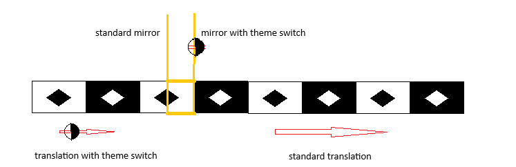

# Repeating Patterns

## Introduction
Sometimes, you notice that a fragment of a drawing (or some other decorated surface) can appear in multiple places there.
This is typical for wallpaper coverings.
We can say that the entire drawing is made up of such repeated fragments. 
A way to describe it is to say that the fragment has been duplicated (copy/pasted), in a particular way, to make up the entire drawing.
A drawing so created has a remarkable quality - applying the operation used (while duplicating the fragments) to the entire drawing will leave the drawing intact. We call that quality a symmetry of the drawing.
A symmetry is specified in terms of some geometric element.
There are few types of symmetries depending on which element was used.

## Wave Pattern
We will examine different types of symmetries using as an example a drawing of ocean waves stretching indefinitely in both direction.
The drawing was captured from this interactive web site https://www.desmos.com/calculator/1kjfzmamo8 and edited.

### Translations
The most common type of symmetry is a parallel shift by a fixed distance called translation.
The associated geometric element is a vector: a directed segment floating freely but always pointing in the same direction.
In the drawing of waves, the translation vector (shown in the middle left) is parallel to the ocean surface and its length is equal to the distance between 2 adjacent crests (commonly called the wave-length).
The entire drawing can be re-constructed from just one wave selected from between 2 vertical lines, wave-length apart.
The actual shape of the wave depends on how these lines were chosen. 2 examples are shown in the upper left side of the picture.

### Reflections
An ocean wave slopes down from crest in both direction in a similar way.
This is an example of another symmetry called (mirror) reflection.
The geometric element in this case is a fixed vertical (mirror) line.
In the ocean-wave drawing the mirror lines go through crests and bottoms (shown in yellow color).
Note that the entire drawing can be re-created from a half-wave between 2 adjacent mirrors.
That fragment is shown in dark background in the middle of the picture.

### Inversions
The wave when viewed from a mid inflection point slopes in the same up-wards in one direction and downwards in the other.
This type of symmetry is called inversion (or half-turn rotation).
In this case, the associated geometric element is a point  called the center (of rotation or inversion).
It is indicated by small circles in the picture.
The entire drawing can be re-created from a fragment between parallel vertical lines through 2 adjacent centers.
That fragment is shown in dark background on the right side.

### Combinations of Symmetries
Notice that repeating patterns for reflections and inversions overlap and are both half wave-length wide.
Using them together we can recreate the entire drawing from a fragment quarter wave-length wide.
This fragment is a yellow-outline rectangle at the top-right of the picture.

### Glide Reflection
Note that the horizontal line at average sea level is not a mirror symmetry but its combination with half-wave shift is.
Such combined operation is called glide-reflection.

## Trigonometry

The wave picture is in fact a graph of trigonometric function (sin or cos depending on where the origin of x-axis is selected).
Symmetries of the graph correspond to well known trigonometric rules

* sin(x + 2&pi;) = sin(x) - translation

* cos(-x) = cos(x) - reflection

* sin(-x) = -sin(x) - inversion

* sin(x + &pi;) = -sin(x) - glide-reflection

## Appearance Operations
### Theme switching
We can alter a black-and-white drawing by toggle between white and black everywhere. This is ability is available in many computer displays where one can switch between light and dark theme. Theme switching cannot be a symmetry by itself but combining it with a standard symmetry operation can be. Such combined symmetry allows to reduce the size of the repeating pattern (here, rectangle outlined yellow). 

### Ionic crystals

If a crystal is made of 2 types of molecules then standard repeating pattern would need to involve both molecules. However in an ionic crystal the important chemical property is the charge and the 2 types have the same charge magnitude and opposite sign. In such cases we could used approach similar to that in theme switching by adding an appearance operation which reverses the sign for all molecules in the crystal.
In that case the repeating pattern can be reduced to include one molecule.
