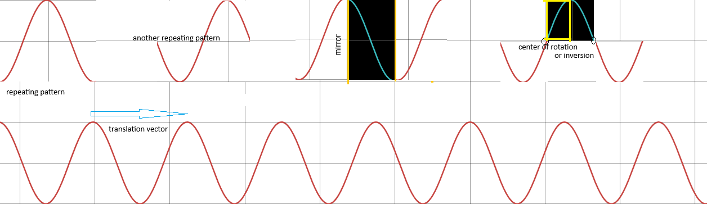

# Repeating Patterns

## Introduction
Sometimes, you notice that a fragment of a drawing (or some other decorated surface) appears in multiple places there.
In extreme cases, the entire drawing is made up of such repeated fragments. This is typical for wallpaper coverings, for example.
These repetition processes are called symmetries and they rely on a selection of some geometric element.
There are few types of symmetries depending on which element was used.
We will examine these types in detail using as an example a pattern of ocean wave stretching indefinitely in both direction.
The graph was captured from this interactive web site https://www.desmos.com/calculator/1kjfzmamo8 and edited.

## Wave Pattern

### Translations
The most common type of symmetry is a parallel shift by a fixed distance.
This type is called translation.
In this case the associated geometric element is a vector - or a directed segment floating freely but always pointing in the same direction.
In our picture, the translation vector is parallel to the ocean surface and its length is equal to the distance between 2 crests (otherwise known as the wave-length). It is shown in the middle left of the drawing.
The entire drawing can be re-constructed from just one wave selected from between 2 vertical lines which are translation-vector apart.
The actual shape of the wave depends on how these lines were chosen. 2 examples are shown in the upper left side of the picture.

### Reflections
An ocean wave slopes down from crest in both direction in a similar way.
This is an example of another symmetry called (mirror) reflection.
The geometric element in this case is a fixed (mirror) line.
In the ocean-wave picture the mirror lines are vertical lines through crests and bottoms (shown in yellow color).
If a picture has parallel mirror lines then the entire picture can be re-created from the fragment between 2 adjacent mirrors.
That fragment is shown in dark background in the middle of the picture.

### Inversions
The wave when viewed from a mid inflection point slopes in the same up-wards in one direction and downwards in the other.
This type of symmetry is called inversion (or half-trun rotation).
In this case, the associated geometric element is a point  called the center (of rotation or inversion).
It is indicated by small circles in the picture.
If a picture has multiple centers of rotation then it can be re-created from a fragment between parallel lines through 2 adjacent centers.
That fragment is shown in dark background on the right side.

### Group Symmetries
Notice that the reflection repeating pattern and inversion repeating patern overlap and are both half wave-lenght wide.
But we can use them together and recreate the entire wave from a fragment which is quarter wave-length wide.
This fragment is a yellow-outline rectangle at the top-right of the picture.
The associated geometric element is then a vertical mirror line and a center quater wave-length apart.

## Trigonometry

The wave picture is in fact a graph of trigonmetric function (sin or cos depending on where the origin of x-axis is selected).
Symmetries of the graph correspond to well known trigonometric rules

* sin(x + 2&pi;) = sin(x) - translation

* cos(-x) = cos(x) - reflection
* sin(-x) = -sin(x) - inversion
